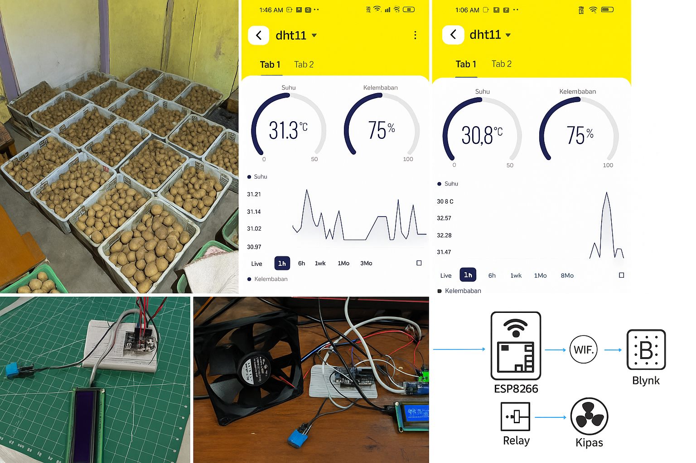
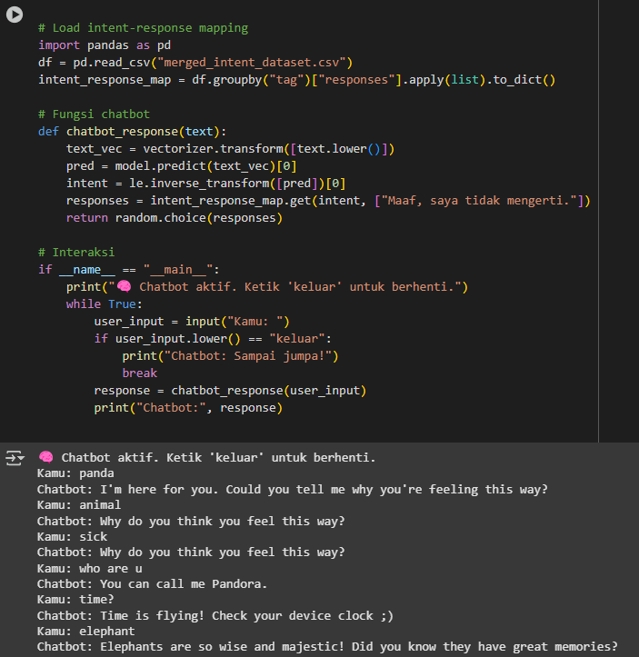
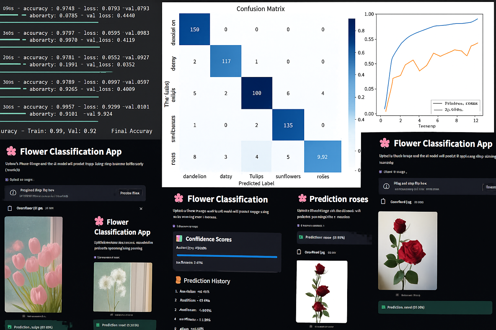
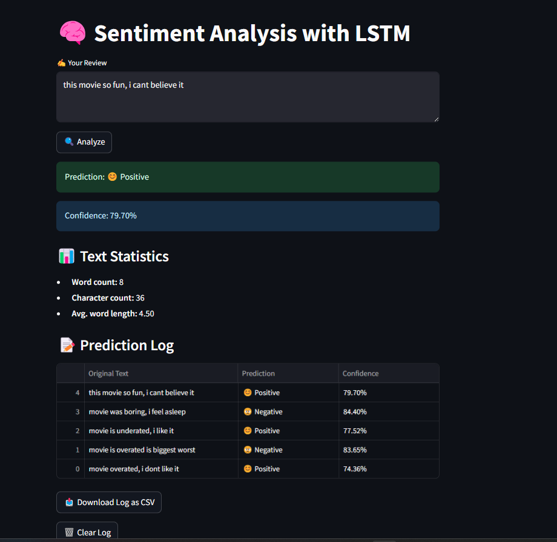

<!--  GIF Header -->

  

<h1 align="center">Hi, I'm Ahmad Syahreza 👋</h1>

  <b>Artificial Intelligence Enthusiast | Fullstack Developer | ML & IoT Explorer</b> 
  <i>Turning ideas into scalable digital products 💡</i>

  

---

## 🚀 Quick Navigation
- [About Me](#-about-me)
- [Tech Stack](#-tech-stack)
- [Featured Projects](#-featured-projects)
- [GitHub Stats](#-github-stats)
- [Trophies & Contributions](#-trophies--contributions)
- [Quote & Activity](#-quote--activity)
- [Social Links](#-social-links)

---

## 💫 About Me:
Tech enthusiast and Informatics graduate passionate about solving real-world problems through digital solutions.  
Currently sharpening skills in **React**, and **Python**, collaborating on open-source and freelance projects.

---

## 💻 Tech Stack:

  

---

## 🌐 IoT Project

---

### 🌱 IoT Monitoring System (Weather and Humidity Potato Farm)
> **Tech Stack:** C++, Arduino, IoT Sensors  
> 📡 Real-time monitoring with optimal control  

🎥 **Demo Video**:  
▶️ [Watch on Google Drive](https://drive.google.com/file/d/1hpPey9D9-b5SMGKkWGjhhE4zkcf4NWHH/view?usp=drive_link)

---

### 🌐 Website Projects

---

### 🛒 M2M Sticker Store (ReactJS Static Website)
> **Tech Stack:** ReactJS  
> ⚡ Static website for an online sticker shop  

🎥 **Demo Video**:  
▶️ [Watch on Google Drive](https://drive.google.com/file/d/1wabzUrPz44Z8RMCCSG_FGjg5u8s-BuhT/view?usp=drive_link)

---

### 🏪 Website Cafe Sejuk
> **Tech Stack:** HTML, SCSS, JavaScript  
> 🛡️ SEJUK’s website is a modern and informative platform that showcases a variety of tea and milk beverages, offering online ordering and business partnership opportunities.  
> 📁 [Repo](https://github.com/zamysyah/WebsiteCafeSejuk)

---

### 🛍️ Django Ecommerce
> **Tech Stack:** Django, JavaScript  
> 🛒 Full-featured e-commerce backend platform
> 📁 [Repo](https://github.com/zamysyah/DjangoEcommerce)

---

### 💼 Financial App with Laravel
> **Tech Stack:** Laravel, PHP, CSS  
> 💸 Financial tracking and invoice recording system
> 📁 [Repo](https://github.com/zamysyah/ProjectLaravel)
> 

---

### 🏬 Warehouse Using Vue.JS
> **Tech Stack:** Flask, Vue.js, JWT  
> 🛡️ Secure login & product management  
> 📁 [Repo](https://github.com/zamysyah/horus-login)

---

### 📊 Data Science & Machine Learning Projects

---

### 🤖 Chatbot (AI + Streamlit)
> **Tech Stack:** Python, Streamlit, Ngrok
> 💬 A lightweight smart assistant built using rule-based logic and conversational memory.
> 📁 [Repo](https://github.com/zamysyah/melby-chatbot)

---

### 📰 Fake News Detection App
> **Tech Stack:** Python, Streamlit, Ngrok
> 🔍 A real-time fake news detection tool powered by machine learning.
> 📁 [Repo](https://github.com/zamysyah/FakeNewsDetector)

---

### 🌸 Flower Image Classification
> **Tech Stack:** Python · TensorFlow · Keras · CNN
> 🧠 A deep learning image classifier trained to recognize five types of flowers (daisy, dandelion, rose, sunflower, tulip) using Convolutional Neural Networks (CNN).
> 📈 Trained on a labeled image dataset with image preprocessing, data augmentation, and performance evaluation using accuracy & loss metrics.
> 🎯 Achieved high validation accuracy and demonstrates robust model generalization.
📁 [Repo](https://github.com/zamysyah/ProjectLaravel)

---

### 💬 Comparison of Weather Prediction Model Performance: Random Forest, Support Vector Regression, and XGBoost
> **Tech Stack:** Python, XGBoost, Random Forest, Support Vector Regressor  
> 📊 This project aims to evaluate and compare the performance of three machine learning models—Random Forest, Support Vector Regression, and XGBoost—in predicting weather conditions based on historical data.
> 📁 [Repo](https://github.com/zamysyah/WeatherPrediction)

---

### 💬 Sentiment Analysis
> **Tech Stack:** Python, Logistic Regression, LSTM  
> 📊 Comparative analysis using traditional ML and Deep Learning
> 📁 [Repo](https://github.com/zamysyah/AnalisisSentiment)

---

### 🩺 Health Dataset Processing & Classification
> **Tech Stack:** Python, Pandas, Sklearn  
> 🧹 From messy datasets to clean, accurate predictions
> optimalisasi model KNN, Naive Bayes, Support Vector Machine, Random Forest, Logistic Regression, Desicion Tree
> 📁 [Repo](https://github.com/zamysyah/ProjectDataScience)

---

<!-- Proudly created with GPRM ( https://gprm.itsvg.in ) -->
---

## 📊 GitHub Stats:

  

  

---

## 🏆 Trophies & Contributions:

  

  

---

## ✍️ Quote & Activity

### 💬 Random Dev Quote

### 📈 GitHub Contribution Activity

---

## 🛡️ Dynamic Badges

  
  
  

---
### 🏅 Achievements

- 🎓 Graduated **cum laude** from Universitas Dian Nuswantoro with a GPA of 3.58  
- 🧠 Independently developed an IoT-based environmental monitoring system and successfully implemented it to support real-time data tracking.  
- 💼 Completed **Kampus Merdeka x Gamelab** program in software engineering  
- 📑 Passed **TOEFL Post-Test (CFLT)** on the first attempt  
- 🏅 Earned **National Certification: Junior Data Scientist (Ilmuwan Data Madya)** from **BNSP**

---

## 🌐 Social Links:

  
  
  
  

---
